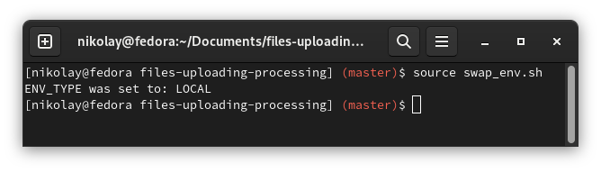
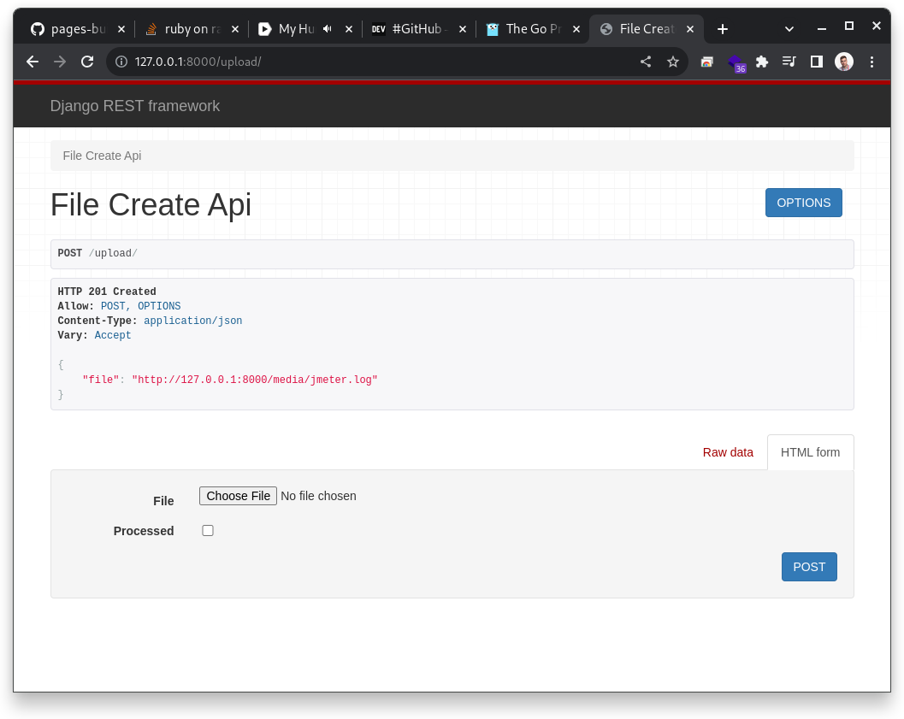
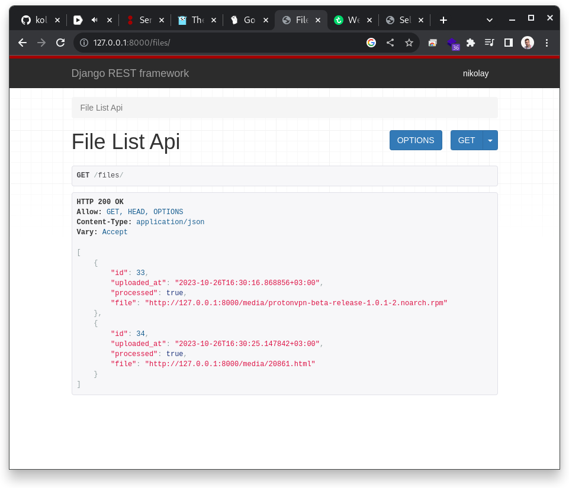
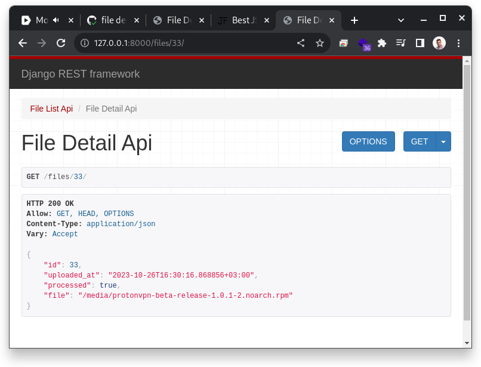
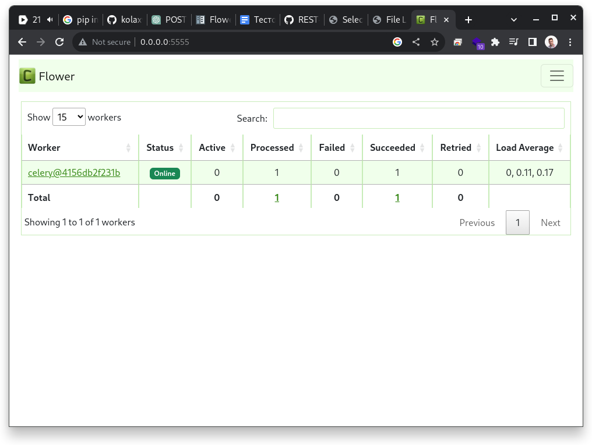

# Uploading and processing files

A Django REST API that allows files to be uploaded to a server and then processed asynchronously using Celery.

## Actions status

[](https://github.com/kolaxy/files-uploading-processing/actions/workflows/testing.yml)
[](https://github.com/kolaxy/files-uploading-processing/actions/workflows/pages/pages-build-deployment)

## Tech stack

- Python 3.11.5
- Django 4.2.6
- Django Rest Framework 3.14.0
- Psycopg 2.9.9
- Redis 5.0.1
- Celery 5.3.14
- Flower 2.0.1
- Pip

## Install&Run | Docker

Start web application and database in Docker

### Clone project

```commandline
git clone git@github.com:kolaxy/files-uploading-processing.git
```

### Cd into

```commandline
cd files-uploading-processing
```

### Build

```commandline
docker compose build
```

### Up

```commandline
docker compose up
```

## Install & Run | Local

Start web application to develop it and see live updates without build/up

### Create and configue database 

You should have installed PostgreSQL

```commandline
psql -U postgres
```

```commandline
CREATE DATABASE filesdb;
```

### Clone project

```commandline
git clone git@github.com:kolaxy/files-uploading-processing.git
```

### Cd into

```commandline
cd files-uploading-processing
```

### Install requirements

Install requirements for the local development (contains psycopg2-binary)

```commandline
pip install -r requirements/development.txt
```

### .env swap

There is a `local.env` file for the local development.
By default `.env` file is used by Docker. To change it, run `swap_env.sh`
Names will be changed.

```commandline
source swap_env.sh
```
    (venv) [nikolay@fedora files-uploading-processing] (master)$ source swap_env.sh
    ENV_TYPE was set to: LOCAL

Now your environment for the local development is right configured.
If you want to run app in Docker, make a swap one more time.



### Migrate and run
```commanline
python manage.py makemigrations
python manage.py migrate
python manage.py runserver 0.0.0.0:8000
```

### Run celery

```commandline
celery -A app worker -l info -P solo
```

# Rest API
    
## Upload file

#### POST /upload/

This method allows the user to send only `file` to the server. (Added RO to the serializer `FileSerializer`)
Rerurning `file`, `uploaded_at` and `processed` 

```commanline
curl -i -X POST -F "file=@files.png" http://localhost:8000/upload/
```
    
    HTTP/1.1 201 Created
    Date: Thu, 26 Oct 2023 13:14:10 GMT
    Server: WSGIServer/0.2 CPython/3.11.6
    Content-Type: application/json
    Vary: Accept, Cookie
    Allow: POST, OPTIONS
    X-Frame-Options: DENY
    Content-Length: 123
    X-Content-Type-Options: nosniff
    Referrer-Policy: same-origin
    Cross-Origin-Opener-Policy: same-origin

    {
        "id": 24,
        "uploaded_at": "2023-10-26T16:14:10.330994+03:00",
        "processed": false,
        "file": "http://localhost:8000/media/files.png"
    }



## Get list of files with processed status

#### GET /files/
```commandline
curl -i -X GET http://localhost:8000/files/
```

    HTTP/1.1 200 OK
    Date: Thu, 26 Oct 2023 13:15:28 GMT
    Server: WSGIServer/0.2 CPython/3.11.6
    Content-Type: application/json
    Vary: Accept, Cookie
    Allow: GET, HEAD, OPTIONS
    X-Frame-Options: DENY
    Content-Length: 124
    X-Content-Type-Options: nosniff
    Referrer-Policy: same-origin
    Cross-Origin-Opener-Policy: same-origin

    [
        {
            "id": 24,
            "uploaded_at": "2023-10-26T16:14:10.330994+03:00",
            "processed": true,
            "file": "http://localhost:8000/media/files.png"
        },
        {
            "id": 26,
            "uploaded_at": "2023-10-26T16:23:46.582734+03:00",
            "processed": true,
            "file": "http://localhost:8000/media/files_TDwjqsq.png"
        },
        {
            "id": 27,
            "uploaded_at": "2023-10-26T16:23:47.307746+03:00",
            "processed": true,
            "file": "http://localhost:8000/media/files_ngYGDWv.png"
        },
    ]



#### GET /files/< int:pk >

```commandline
curl -i -X GET http://localhost:8000/files/33/
```
    HTTP/1.1 200 OK
    Date: Fri, 27 Oct 2023 12:37:38 GMT
    Server: WSGIServer/0.2 CPython/3.11.6
    Content-Type: application/json
    Vary: Accept, Cookie
    Allow: GET, HEAD, OPTIONS
    X-Frame-Options: DENY
    Content-Length: 133
    X-Content-Type-Options: nosniff
    Referrer-Policy: same-origin
    Cross-Origin-Opener-Policy: same-origin

    {
        "id": 33,
        "uploaded_at": "2023-10-26T16:30:16.868856+03:00",
        "processed": true,
        "file": "/media/protonvpn-beta-release-1.0.1-2.noarch.rpm"
    }



# Track tasks

## Flower 

You can track celery tasks by Flower

`http://localhost:5555/`



# Tests

```commandline
Name                   Stmts   Miss  Cover
------------------------------------------
app/__init__.py            2      0   100%
app/celery.py             10      0   100%
app/settings.py           32      0   100%
app/urls.py                5      0   100%
files/__init__.py          0      0   100%
files/admin.py             3      0   100%
files/apps.py              4      0   100%
files/models.py            8      0   100%
files/serializers.py       8      0   100%
files/tasks.py            12      0   100%
files/tests.py            97      0   100%
files/urls.py              3      0   100%
files/views.py            37      3    92%
manage.py                 12      2    83%
------------------------------------------
TOTAL                    233      5    98%
```

## Manual testing

### Directory

```commandline
cd app
```

### Run tests
```
coverage run manage.py test
```

### See result
```
coverage report --omit="*/migrations/*"
```
