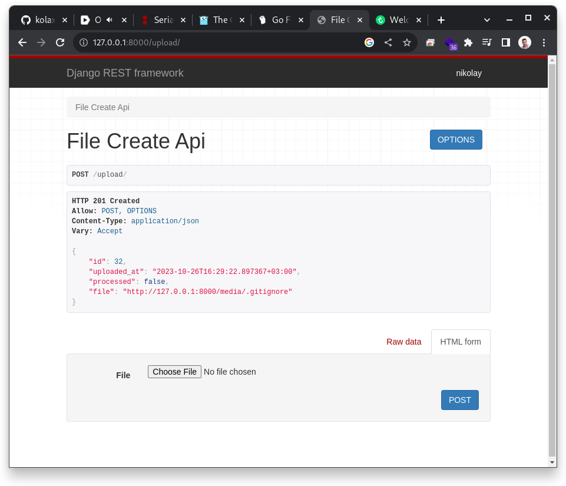

# Uploading and processing files

A Django REST API that allows files to be uploaded to a server and then processed asynchronously using Celery.

## Actions status

[](https://github.com/kolaxy/files-uploading-processing/actions/workflows/testing.yml)
[](https://github.com/kolaxy/files-uploading-processing/actions/workflows/pages/pages-build-deployment)

## Tech stack

- Python 3.11.5
- Django 4.2.6
- Django Rest Framework 3.14.0
- Psycopg 2.9.9
- Redis 5.0.1
- Celery 5.3.14
- Flower 2.0.1
- Pip

## Install&Run | Docker

Start web application and database in Docker

### Clone project

```commandline
git clone git@github.com:kolaxy/files-uploading-processing.git
```

### Cd into

```commandline
cd files-uploading-processing
```

### Build

```commandline
docker compose build
```

### Up

```commandline
docker compose up
```

## Install & Run | Local

Start web application to develop it and see live updates without build/up

### Create and configue database 

You should have installed PostgreSQL

```commandline
psql -U postgres
```

```commandline
CREATE DATABASE filesdb;
```

### Clone project

```commandline
git clone git@github.com:kolaxy/files-uploading-processing.git
```

### Cd into

```commandline
cd files-uploading-processing
```

### Install requirements

Install requirements for the local development (contains psycopg2-binary)

```commandline
pip install -r requirements/development.txt
```

### .env swap

There is a `local.env` file for the local development.
By default `.env` file is used by Docker. To change it, run `env_swap.sh`
Names will be changed.

```commandline
source env_swap.sh
```
Now your environment for the local development is right configured.
If you want to run app in Docker, make a swap one more time.

### Migrate and run
```commanline
python manage.py makemigrations
python manage.py migrate
python manage.py runserver 0.0.0.0:8000
```

### Run celery

```commandline
celery -A app worker -l info -P solo
```

# Rest API
    
## Get list of files with processed status

`GET /files/`

    curl -i -H 'Accept: application/json' http://localhost:8000/files/

    HTTP/1.1 200 OK
    Date: Wed, 25 Oct 2023 11:13:26 GMT
    Server: WSGIServer/0.2 CPython/3.11.5
    Content-Type: application/json
    Vary: Accept, Cookie
    Allow: GET, HEAD, OPTIONS
    X-Frame-Options: DENY
    Content-Length: 2
    X-Content-Type-Options: nosniff
    Referrer-Policy: same-origin
    Cross-Origin-Opener-Policy: same-origin

    []


## Upload file

`POST /upload/`

    curl -i -X POST -F "file=@/pathToYourFile" http://localhost:8000/upload/

    HTTP/1.1 201 Created
    Date: Wed, 25 Oct 2023 11:16:37 GMT
    Server: WSGIServer/0.2 CPython/3.11.5
    Content-Type: application/json
    Vary: Accept, Cookie
    Allow: POST, OPTIONS
    X-Frame-Options: DENY
    Content-Length: 53
    X-Content-Type-Options: nosniff
    Referrer-Policy: same-origin
    Cross-Origin-Opener-Policy: same-origin

    {"file":"http://localhost:8000/media/production.yml"}



# Track tasks

## Flower 

You can track celery tasks by Flower

`http://localhost:5555/`


# Tests

```commandline
Name                   Stmts   Miss  Cover
------------------------------------------
app/__init__.py            2      0   100%
app/celery.py             10      0   100%
app/settings.py           32      0   100%
app/urls.py                5      0   100%
files/__init__.py          0      0   100%
files/admin.py             3      0   100%
files/apps.py              4      0   100%
files/models.py            8      0   100%
files/serializers.py      12      0   100%
files/tasks.py            12      0   100%
files/tests.py            66      0   100%
files/urls.py              3      0   100%
files/views.py            28      3    89%
manage.py                 12      2    83%
------------------------------------------
TOTAL                    197      5    97%
```

## Manual testing

### Directory

```commandline
cd app
```

### Run tests
```
coverage run manage.py test
```

### See result
```
coverage report --omit="*/migrations/*"
```
